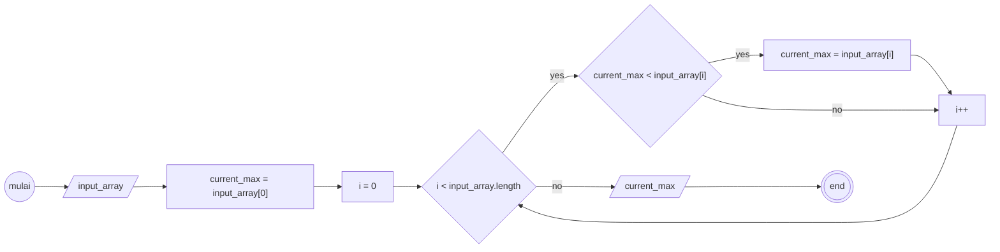
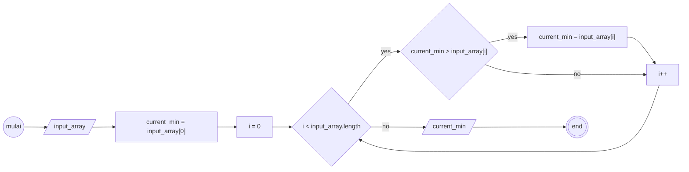
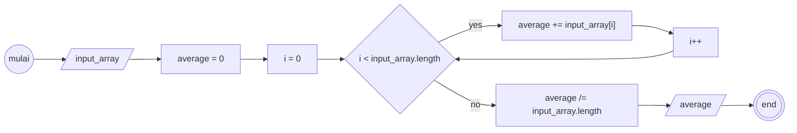

# Max

```mermaid

flowchart LR
    Start((mulai))

    InputArray[/input_array/]
    CurrentMax["current_max = input_array[0]"]
    Cek{"current_max < input_array[i]"}
    AssignMaxCurrent["current_max = input_array[i]"]
    
    I[i = 0]
    TambahI[i++]
    CekI{i < input_array.length}

    CetakHasil[/current_max/]

    End(((end)))

    Start --> InputArray
    InputArray --> CurrentMax

    CurrentMax --> I 
    I --> CekI
    CekI --> |yes| Cek
    Cek --> |yes| AssignMaxCurrent
    Cek --> |no| TambahI
    AssignMaxCurrent --> TambahI
    TambahI --> CekI

    CekI --> |no| CetakHasil
    CetakHasil --> End

```

# Min

```mermaid

flowchart LR
    Start((mulai))

    InputArray[/input_array/]
    CurrentMin["current_min = input_array[0]"]
    Cek{"current_min > input_array[i]"}
    AssignMaxCurrent["current_min = input_array[i]"]
    
    I[i = 0]
    TambahI[i++]
    CekI{i < input_array.length}

    CetakHasil[/current_min/]

    End(((end)))

    Start --> InputArray
    InputArray --> CurrentMin

    CurrentMin --> I 
    I --> CekI
    CekI --> |yes| Cek
    Cek --> |yes| AssignMaxCurrent
    Cek --> |no| TambahI
    AssignMaxCurrent --> TambahI
    TambahI --> CekI

    CekI --> |no| CetakHasil
    CetakHasil --> End

```

# Average

```mermaid

flowchart LR
    Start((mulai))

    InputArray[/input_array/]
    Avg[average = 0]
    AvgAssign[average /= input_array.length]
    
    AssignAvg["average += input_array[i]"]
    
    I[i = 0]
    TambahI[i++]
    CekI{i < input_array.length}

    CetakHasil[/average/]

    End(((end)))

    Start --> InputArray
    InputArray --> Avg

    Avg --> I 
    I --> CekI
    CekI --> |yes|AssignAvg
    AssignAvg --> TambahI
    TambahI --> CekI

    CekI --> |no| AvgAssign
    AvgAssign --> CetakHasil
    CetakHasil --> End

```
